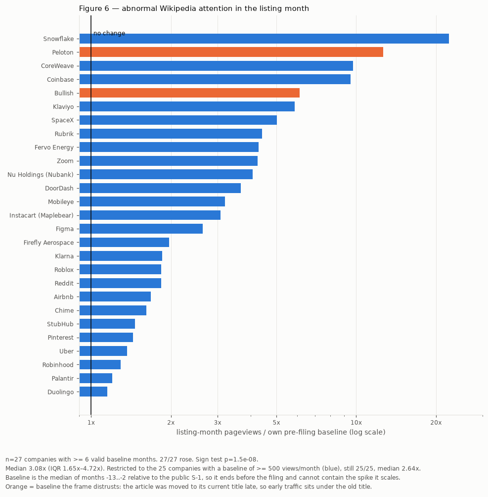
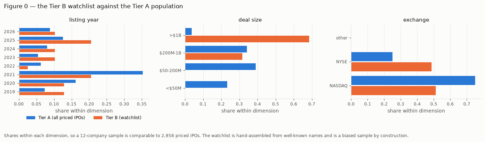

# IPO Surveillance Platform

Two things live in this repository:

1. **A research study** on whether online attention affects IPO underpricing —
   in [`research/`](research/).
2. **The deployed pipeline** it grew out of — SEC EDGAR ingestion, entity
   resolution against pre-ticker issuers, a FastAPI backend and a Next.js
   dashboard. Starts at [The platform](#the-platform).

> Neither half is a stock recommender. Nothing here tells you what to buy.

---

# The study

## The question

Does attention on **any** online platform move IPO underpricing — the first-day
pop between the offer price and the first close?

The plan was to test whichever platform gave usable data. Four were tried, in
order.

## The platform search

| Platform | Outcome |
|---|---|
| **News (GNews, NYT)** | GNews grants 30 days of history and strips article payloads. NYT works but is **zero in 63% of months** more than six months before a filing. |
| **Reddit** | `redditapis.com` has no date-range parameter at all — one page of `sort=new` spanned 2.17 days. Unauthenticated endpoints return `403`. Usable only for coarse before/after windows. |
| **X (Twitter)** | Counts are **right-censored**, and pagination is newest-first, so a monthly count read **0 for Figma** — the most-discussed design tool on the platform — because the budget ran out before reaching the window. |
| **Hacker News** | A sweep of 1,004,502 items found meaningful discussion for **1 of 166** candidates. |
| **Wikipedia** | Keyless, absolute, deterministic, complete back to 2015. **The only instrument with coverage good enough to test the question.** |

Reddit and X were still good enough to *replicate* the attention-spike finding
below. None of them could support the underpricing test. Wikipedia could.

## The finding

**Companies that already had a Wikipedia article before going public are more
underpriced — roughly 5 percentage points more.**

| | n | mean underpricing |
|---|---:|---:|
| had an article before listing | 128 | **+22.6%** |
| no prior article | 401 | **+17.1%** |
| **difference** | | **+5.5 pp** |

529 US IPOs, 2014–2024. SE 3.26, t = 1.70, **p = 0.091**, 95% CI
[−0.9, +11.9] pp. The estimate is stable across every treatment of the hard
matches (+4.6 to +5.6 pp).

An earlier, noisier in-repo cohort points the same way: at n=456 the median gap
is +8.8pp (17.1% vs 8.3%) with a controlled estimate of **+3.6pp (SE 8.18)**.
Two independent samples, both positive, converging on roughly +4 to +6 pp.

**Three caveats travel with that number, and the claim is only honest with
them:**

- The confidence interval **includes zero**. p = 0.091 clears 10%, not 5%.
- The gap **does not survive controls**. Add VC backing and offer size and the
  coefficient falls to +0.6pp (p = 0.86) — those two variables absorb it
  entirely. So this is a difference between two groups, not evidence that
  Wikipedia *causes* anything.
- Four platforms were tried before this one. Searching across instruments
  weakens a p = 0.09; adjusted for the search it is not close to significant.

Full method and every robustness check:
[`research/underpricing/`](research/underpricing/) and its
[RESULTS.md](research/data/underpricing/out/RESULTS.md).

## Why Wikipedia was the right instrument: attention multiplies at the listing

The strongest relationship in the project, and the reason article existence is a
sensible treatment at all.

For each company, listing-month Wikipedia pageviews are divided by that
company's **own** baseline — the median of months −13 to −2 relative to its
public S-1, so the denominator ends before the filing. Cross-company levels are
meaningless (SpaceX draws 81,000 views/month before anyone files anything), so
every company is compared only against itself.



**All 27 companies with a usable baseline rose. Median 3.08×, sign test
p = 1.5 × 10⁻⁸.** The weakest case, Duolingo, still rose 1.15×; Snowflake rose
22×. It survives every filter, and the effect gets *smaller* as the sample gets
cleaner — the direction an artifact does not move in.

| baseline floor | companies | rose | median | sign test |
|---|---|---|---|---|
| none | 27 | **27/27** | 3.08× | p = 1.5e-08 |
| ≥ 5,000 views/mo | 21 | **21/21** | 1.97× | p = 9.5e-07 |
| ≥ 10,000 views/mo | 16 | **16/16** | 1.85× | p = 3.1e-05 |

And it replicates on the other two platforms:

| instrument | usable | rose after listing | test |
|---|---|---|---|
| Wikipedia | 27 companies | **27/27** | p = 1.5 × 10⁻⁸ |
| X posts, 90-day windows | 25 pairs | 20/25, **0 reverse** | censored-safe |
| Reddit posts, 90-day windows | 11 pairs | **11/11** | p = 0.001 |

Attention is *created* by the listing, not accumulated before it. Nothing
detectable moves in the years beforehand.

## The other finding that holds up: everyone filed confidentially first

Under the JOBS Act an emerging growth company files a **confidential** draft
registration statement before its public S-1, and EDGAR exposes it only once the
company goes public.

**All 39 watchlist companies that filed a US registration statement had filed it
confidentially first** — a median of **96 days** earlier, up to **1,408**.
StubHub filed confidentially in November 2021 and publicly in March 2025:
**1,229 days**.

Any study treating the public S-1 as "the start of the IPO process" is
mismeasuring its event date — including this project's own deployed pipeline.
This is a count of filings in EDGAR: no sampling inference, no contested
statistic.

Anchored on the confidential filing, **14 of 20 companies rose into the
confidential window (p = 0.115)** — not significant. The public filing is the
attention event.

## The sample is biased, and here is how much

A census of every US IPO 2019–2026 (**4,132 records**) exists so the hand-picked
watchlist can be *shown* unrepresentative rather than disclaimed as such.



The watchlist is **68% billion-dollar deals against a population that is 3.6%**,
and contains nothing from the two smallest deal-size buckets — 62% of all priced
IPOs. "Companies everyone remembers going public" is close to "the largest
offerings."

## Things that were nearly published and were not

- An **8-A anchor** that invented four date disagreements — an 8-A registers a
  security class before trading starts.
- A Wikipedia title whose traffic belonged to a **Max Factory action-figure
  line** (`figma`), and another to a **Chinese county** (Huize).
- A Reddit sweep that would have reported SpaceX's pre-filing count as **0**
  when it had never looked that far back.
- A price panel with a standard deviation of **249pp** — impossible for
  first-day returns — caused by Yahoo's split history being incomplete for
  micro-caps.

Prior work on this exact question: *Wikipedia and IPO Underpricing*,
The Financial Review, [10.1111/fire.12276](https://doi.org/10.1111/fire.12276),
which finds +5.22pp on 974 US IPOs 2006–2016.

---

# The platform

SEC EDGAR ingestion, prospectus extraction, entity resolution against
**pre-ticker** issuers (the hard part — no symbol to search for yet), a FastAPI
backend and a Next.js dashboard.

It scores each issuer on two axes — **hype** (mention volume and velocity,
z-scored across the active cohort) and **quality** (revenue growth, margin,
leverage, underwriter tier) — giving **Hidden Gems** (quality without attention)
and **Overheated** (attention without support).

## Scope and data handling

A personal, **non-commercial** learning project. Not a product, not monetised,
no users other than its author.

- **Read-only.** The source adapter interface exposes one method,
  `fetch(since) -> list[RawMention]`. There is no code path that writes to any
  external platform.
- **Usernames are never stored.** Authors persist only as
  `mentions.author_hash`, SHA-256 salted with a value held outside the database.
  The raw username is discarded at ingestion. The only supported use is counting
  *distinct* authors per issuer per day.
- **90-day retention on raw content.** Individual `mentions` rows are deleted 90
  days after `posted_at`; daily aggregates persist. Recorded in the database as
  a `COMMENT ON TABLE` so it survives a `pg_dump`.
- **Aggregate analysis only.** The unit of analysis is the issuer, never the
  person.
- **Identified, rate-limited traffic.** Descriptive `User-Agent` with a real
  contact address; SEC EDGAR capped at its published 10 req/s.

### Sources

| Source | Auth | Status |
|---|---|---|
| SEC EDGAR | none; identified `User-Agent` | in use |
| Hacker News (Algolia) | none | in use |
| GDELT (DOC 2.0) | none | adapter written, live fetch blocked |
| Reddit | OAuth, keyed | built, inactive until credentials are set |

> **GDELT caveat:** the adapter matches the documented DOC 2.0 schema and its
> transform is unit-tested, but it has never received a live response — every
> request returned `429` while GDELT's `summary` endpoint returned `200`. The
> field mapping is documented-but-unconfirmed, and it is not counted as working.

**Reddit goes through OAuth or not at all** — `client_credentials` carries no
user context, so it cannot post, vote or message. Registered only when both
`REDDIT_CLIENT_ID` and `REDDIT_CLIENT_SECRET` are set. Unauthenticated
endpoints are not an alternative: `search.json` → `403`, `/r/*/new.json` →
`403`, `old.reddit.com` → `302` to a block page.

## What was measured

Each figure from a hand-labelled set scored **before** any tuning.

| | | measured on |
|---|---|---|
| **Prospectus extraction** | **75%** price accuracy | 12 held-out filings, scored once before tuning |
| **Entity resolution** | **0.70** precision | 100 sampled matches from 1,004,502 HN items |
| **Event detection** | **0.99** recall | 160 of 162 priced IPOs on an independent calendar |

Recall for entity resolution is unbounded between 0.11 and 0.84, so no single
number is quoted.

**The event study is a null.** Only **6 of 188** confirmed listings have matched
attention within 14 days of listing, so 96–98% of the sample sits at zero. The
30-day `p = 0.048` rests on 6 observations and is not a finding.

One result there *is* well powered and is not about attention: **buying at the
opening price lost money at the median over every horizon** — −8.5% at 30 days,
−15.9% at 60, −15.7% at 90, with 63–68% of listings negative.

**Two findings that changed the project:** 97% of matched attention belongs to
companies that already trade; and an absence-based filter excluded 195 of 199
real listing events, because a company acquires a ticker precisely *by*
completing the event being observed.

Full write-ups: [extraction](docs/extraction-eval.md) ·
[matching](docs/matching.md) · [event study](docs/event-study-design.md)

## Status

| Phase | Scope | State |
|---|---|---|
| 0 | Schema, migrations, `/health` | done |
| 1 | `GET /api/v1/issuers` → Next.js list | **current** |
| 2a/2b | EDGAR ingestion; prospectus extraction | done |
| 3a/3b | Retention sweep, adapters; entity resolution | done |
| 4 | Scoring | **next** |
| 5–6 | Dashboard; hardening + deploy | not started |

## Stack

**Backend** — Python 3.13, FastAPI, `asyncpg` with hand-written SQL (no ORM),
numbered `.sql` migrations via `backend/migrate.py`, `pydantic-settings`.
**Frontend** — Next.js 16 App Router, TypeScript, Tailwind.
**Infra** — Postgres 17 in a container locally, Neon when deployed.

## Setup

```bash
cp .env.example .env      # edit POSTGRES_PASSWORD
docker compose up --build
```

That starts `db` (Postgres 17, healthchecked) → `migrate` (one-shot, exits 0) →
`api` (FastAPI on `:8000`) and `worker` (EDGAR ingestion, own process).

```bash
curl -s localhost:8000/health | jq      # 200 means a real DB round-trip
uv run python -m backend.seed           # ten real SEC registrants
```

The health timestamp comes from `SELECT now()` inside Postgres, not the API
process, so a 200 means a connection was borrowed and a query ran. Unreachable
database returns `503`. Interactive docs: <http://localhost:8000/docs>

Dashboard:

```bash
cd frontend && cp .env.example .env.local && npm install && npm run dev
```

## API

Versioned under `/api/v1`. Every list endpoint uses cursor pagination and
returns `{ "data": [...], "meta": { "next_cursor": ... } }`.

```
GET  /health                     liveness + a real DB round-trip
GET  /api/v1/issuers             ?status= &sort=filed_at &limit= &cursor=
GET  /api/v1/review/queue        low-confidence matches awaiting a human
POST /api/v1/review/{mention_id} confirm or reject a proposed match
```

## Ingestion

```bash
uv run python -m backend.worker --once   # one pass
uv run python -m backend.worker          # schedule and stay up
```

Polls EDGAR's daily indexes for `S-1`, `S-1/A`, `F-1`, `F-1/A` and `424B4`, then
upserts `issuers` and `filings`.

**Idempotency is structural.** No watermark, no "already processed" bookkeeping.
Each run re-reads a rolling window (`SEC_LOOKBACK_DAYS`, default 7) and leans on
two constraints: `accession_no` is UNIQUE so a re-read inserts nothing, and
`cik` is UNIQUE so the issuer upsert merges. Safe to restart mid-run or leave
off for a week.

**Status only moves forward** — `filed → priced → listed`, enforced with
`array_position` in the upsert, so the sliding lookback cannot drag a priced
issuer back to `filed`.

## Running without containers

```bash
uv sync
# point POSTGRES_HOST/PORT at any Postgres 17
uv run python -m backend.migrate   # apply schema
uv run fastapi dev                 # serve on :8000 with reload
```

No path argument needed — the entrypoint is declared under `[tool.fastapi]` in
`pyproject.toml`.

## Migrations

Plain SQL in `migrations/`, `NNN_description.sql`, applied in numeric order by
`backend/migrate.py`. Each applied file is recorded in `schema_migrations` with
a SHA-256 of its contents, enforcing three rules:

- **Never edit an applied migration** — the checksum catches it and refuses.
- **Never backfill a lower number** — the result would be a schema no fresh
  database could reproduce.
- **One transaction per migration** — Postgres has transactional DDL, so a
  half-failed migration leaves nothing behind.

Concurrent runners are serialized with a session advisory lock.

Tests need local Postgres settings and refuse to run otherwise:

```bash
POSTGRES_HOST=localhost POSTGRES_USER=ipo POSTGRES_PASSWORD=local_dev_password \
POSTGRES_DB=ipo POSTGRES_SSLMODE=prefer uv run pytest tests/ -q
```

That guard exists because the suite reads `.env`, so once `.env` was filled in
for the deploy, `pytest` began opening transactions against production. Every
test rolls back, so nothing was lost — but that was luck, not design.

## Schema

Ten tables in `migrations/001_initial_schema.sql`. Two load-bearing decisions:

**`mentions.issuer_id` is nullable.** An unresolved mention is *kept*, with a
`match_confidence` and a `needs_review` flag, rather than dropped. "Circle",
"Figure" and "Rivian" are ordinary words, brand names and ticker-like strings at
once, so the pipeline is built to be audited — discarding misses would make
precision unmeasurable.

**`scores` is precomputed.** One snapshot per issuer per day; the API only
reads. Scoring is cohort-relative (a z-score needs every peer's volume), so
computing per request would scan the cohort on every page load.

Money and ratios are `NUMERIC`, never float. Status/kind/role columns are
`TEXT` + `CHECK` rather than `ENUM`, so a later migration can change the allowed
set with an ordinary `ALTER TABLE`.

## Layout

```
migrations/          numbered .sql, applied in order
backend/
  main.py            FastAPI app, lifespan, CORS
  config.py db.py    settings + DSN; asyncpg pool and Depends wiring
  pagination.py      opaque cursor encode/decode
  normalize.py       company-name normalisation for entity resolution
  migrate.py seed.py worker.py http.py
  sources/           RawMention + SourceAdapter; hackernews, gdelt
  sec/               the only place that talks to sec.gov
  extract/           HTML -> text, cover-page location, price + underwriters
  match/             alias generation, scored matching, bundled common words
  ingest/            idempotent upserts, social, offerings, 90-day retention
tests/               hand-labelled validation sets (dev + held-out)
frontend/            Next.js App Router; server-rendered issuer table
research/            the study -- see research/README.md
  collect/           one module per source: wikipedia, nyt, reddit, twitter,
                     edgar, prices, census
  underpricing/      the Wikipedia-vs-underpricing arm: pipeline, crawler,
                     three notebooks
  data/              committed outputs; data/underpricing/{raw,cache} ignored
  figures.py         figure frames, then plots that read only those frames
docker-compose.yml   db + migrate + api
```

The pre-FastAPI Django/Celery version lives in git history at commit `81691fc`
and earlier.
