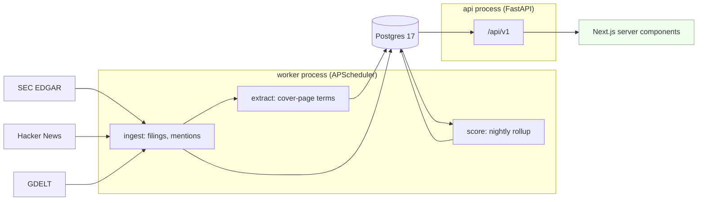

# IPO Surveillance Platform

Surveillance and anomaly detection over US IPO registrations and the social
chatter around them.

The system ingests upcoming IPO filings from SEC EDGAR and social mentions from
Reddit, links unstructured chatter to **pre-ticker** issuers (the hard part —
these companies have no symbol to search for yet), and scores each issuer on two
independent axes:

- **Hype** — social mention volume and velocity, z-scored across the active cohort.
- **Quality** — revenue growth, margin, leverage, and underwriter tier from the filings.

Two views fall out of the pair: **Hidden Gems** (quality without attention) and
**Overheated** (attention without fundamental support).

> This is a surveillance tool, not a stock recommender. It measures attention and
> reports fundamentals. It does not tell you what to buy.

---

## Scope and data handling

This is a personal, **non-commercial** learning project. It is not a product, it
is not monetised, it has no users other than its author, and nothing it produces
is sold or served to third parties.

**Read-only.** The system consumes public data and writes nothing back. It does
not post, comment, vote, message, follow, or modify anything on any external
platform. There is no code path that issues a write to a social API — the source
adapter interface exposes a single method, `fetch(since) -> list[RawMention]`.

**Usernames are never stored.** Social authors are persisted only as
`mentions.author_hash`, a SHA-256 salted with a value held outside the database
(`MENTION_HASH_SALT`). The raw username is discarded at ingestion and never
written to disk or logged. The only supported use of the hash is counting
*distinct* authors per issuer per day, so that ten posts from one account are not
mistaken for ten people talking. The system does not profile users, infer user
characteristics, build user-level histories, or attempt re-identification.

**90-day retention on raw content.** Individual `mentions` rows — title, excerpt,
URL, author hash — are deleted 90 days after `posted_at` by a scheduled sweep.
The daily aggregates in `mention_daily` (counts and distinct-author totals)
persist, because the long-run signal lives there. This is what keeps the project
a metrics pipeline rather than an archive of other people's posts. The policy is
recorded in the database itself as a `COMMENT ON TABLE`, so it survives a
`pg_dump` and is visible to anyone auditing the schema.

**Aggregate analysis only.** The unit of analysis is the *issuer*, never the
person. Posts are counted and their engagement is summed; they are not
republished. Stored excerpts exist so a human reviewer can audit whether a
company-name match was correct, which is the review queue's entire purpose.

**Identified, rate-limited traffic.** Every outbound request carries a
descriptive `User-Agent` with a real contact address, and each source's rate
limit is enforced in one place with exponential backoff. SEC EDGAR is capped at
its published 10 requests/second.

### Sources

| Source | Auth | Status |
|---|---|---|
| SEC EDGAR | none required; identified `User-Agent` | in use |
| Hacker News (Algolia) | none required | in use |
| GDELT (DOC 2.0) | none required | adapter written, live fetch blocked — see below |
| Reddit | OAuth, keyed | adapter built, inactive until credentials are set |

> **GDELT caveat, stated rather than hidden:** the adapter is written to the
> documented DOC 2.0 `artlist` schema and its transform is unit-tested, but it
> has never received a live response. Every request from this machine returned
> `429` over ~10 minutes, including single requests after 150 seconds of
> silence, while GDELT's `summary` endpoint returned `200` — so the host is
> reachable and this is not our request rate. The field *mapping* is therefore
> documented-but-unconfirmed. It is not counted as a working source.

**Reddit goes through OAuth or not at all.** The adapter authenticates against
`oauth.reddit.com` with a `client_credentials` bearer token. That grant carries
no user context, so it cannot post, vote, or message — read-only by
construction rather than by discipline. It sits behind the same
`SourceAdapter` interface as every other source and is subject to the same
author hashing and 90-day retention.

It is registered **only** when `REDDIT_CLIENT_ID` and `REDDIT_CLIENT_SECRET`
are both set. An unconfigured deployment issues no request to `reddit.com`.

Unauthenticated endpoints are not an alternative. Measured from a residential
IP with a descriptive `User-Agent`: `reddit.com/search.json` → `403`,
`/r/*/new.json` → `403`, `old.reddit.com/search.json` → `302` to a block page.
Reddit closed that access, so an adapter built on it would contribute zero
mentions permanently. Details in [`docs/sources.md`](docs/sources.md).

---

## What was measured

Three accuracy figures, each from a hand-labelled set scored **before** any
tuning. The caveats are part of the result.

| | | measured on |
|---|---|---|
| **Prospectus extraction** | **75%** price accuracy | 12 held-out filings, scored once before tuning. Reads 92% after fixing what that run exposed — on a set that is no longer clean. |
| **Entity resolution** | **0.70** precision | 100 sampled matches from 1,004,502 Hacker News items. Substring matching over the same corpus is 4.3% precise. |
| **Event detection** | **0.99** recall | 160 of 162 priced IPOs on Finnhub's independent calendar, from SEC filings alone. Precision 0.79. |

**Recall for entity resolution is unbounded between 0.11 and 0.84.** A 40-item
reject sample against 161,013 candidates cannot narrow it, so no single recall
number is quoted.

### The sample size is the binding constraint

The event study tests whether attention around a listing predicts
underperformance from the opening price. It needs attention data on *both* sides
of the listing date and a return horizon after it, and joint availability is
small:

| attention corpus | 30-day | 60-day | 90-day |
|---|---|---|---|
| 90 days | 24 | 9 | **0** |
| 210 days — the ceiling | 74 | 59 | 25 |

That zero was **structural, not unlucky**: a 90-day return needs a listing at
least 90 days old, and attention ±14 days around it then falls before a 90-day
corpus begins. Past 210 days the constraint stops being attention and becomes
EDGAR depth.

### The event study: a null result

Does elevated attention around a listing predict underperformance from the
opening price? **No usable relationship — the attention axis is too sparse to
test the thesis.** Window (±14 days), horizons, metric and test were all fixed
before the data was seen.

| horizon | n | with attention | Spearman ρ | p | median return |
|---|---|---|---|---|---|
| 30 days | 171 | **6** | 0.151 | 0.048 | −8.5% |
| 60 days | 157 | 4 | 0.133 | 0.099 | −15.9% |
| 90 days | 112 | 2 | 0.083 | 0.418 | −15.7% |

Only **6 of 188** confirmed listings have any matched attention within 14 days of
listing, so 96–98% of the sample sits at zero. A rank correlation over a variable
that is zero almost everywhere is decided by a handful of points: the 30-day
`p = 0.048` rests on **6 observations** and is not a finding. Its sign is also
opposite the hypothesis — the discussed listings did *better*.

**One result here is well powered, and it is not about attention:** buying at the
opening price lost money at the median over every horizon — −8.5% at 30 days,
−15.9% at 60, −15.7% at 90, with 63–68% of listings negative. A descriptive fact
about this window, not a test of the thesis.

Reproduce with `python -m backend.study`. Returns are derived from the stored bar
series on read, never cached.

### Two findings that changed the project

**97% of matched attention belongs to companies that already trade.** Across 90
days of Hacker News, only 42 mentions attached to a pre-IPO issuer — all of them
one company. The supportable claim is narrow: *Hacker News is the wrong venue
for this cohort.* Retail pre-IPO discussion lives on Reddit, which is gated
behind a pending API approval.

**An absence-based filter excluded 195 of 199 real listing events.** It defined
an IPO candidate as an issuer with no ticker — and a company acquires a ticker
precisely *by* completing the event being observed. See
[`docs/form-type-vs-event.md`](docs/form-type-vs-event.md), which collects three
separate bugs with that one root cause.

Full write-ups: [extraction](docs/extraction-eval.md) ·
[matching](docs/matching.md) · [event study](docs/event-study-design.md)

---

## Architecture

Three processes and one database. The API never computes anything expensive; the
worker never serves a request.



**Why the worker is a separate process.** Ingestion spends most of its wall-clock
asleep against a rate limiter, and a crash while parsing a 3 MB prospectus should
not take request-serving down with it. They share only the database.

**Why scores are precomputed.** A hype score is cohort-relative — a z-score needs
every peer's mention volume — so computing it per request would scan the cohort
on every page load, and two users hitting the same page would see different
numbers.

**Why the frontend has no direct database access.** Next.js server components
call FastAPI over HTTP. That keeps one implementation of every query and one
place where authorisation will live, rather than two.

**Idempotency is structural.** No watermarks, no "already processed" bookkeeping.
The poller re-reads a rolling window and leans on `filings.accession_no` and
`mentions(source, source_uid)` being UNIQUE. That is what makes the worker safe
to restart mid-run or leave off for a week.

---

## Status

| Phase | Scope | State |
|---|---|---|
| 0 | Skeleton: schema, migrations, `/health` | done |
| 1 | Vertical slice: `GET /api/v1/issuers` → Next.js list | **current** |
| 2a | EDGAR ingestion worker (issuers + filings) | done |
| 2b | Prospectus extraction (underwriters, price range) | done |
| 3a | Retention sweep, adapter interface, HN + GDELT | done |
| 3b | Entity resolution + matching evaluation | done |
| 4 | Scoring | **next** |
| 5 | Dashboard | not started |
| 6 | Hardening + deploy | not started |

---

## Stack

**Backend** — Python 3.13, FastAPI, `asyncpg` with hand-written SQL (no ORM),
numbered `.sql` migrations applied by `backend/migrate.py`, `pydantic-settings`
for config. Workers run as a separate process (Phase 2).

**Frontend** — Next.js 16 App Router, TypeScript, Tailwind (wired up in Phase 1).

**Infra** — Postgres 17 in a container locally, Neon when deployed.

---

## Setup

### 1. Configure

```bash
cp .env.example .env
# edit POSTGRES_PASSWORD
```

`.env` is gitignored. It configures both the Postgres container and the app —
`docker-compose.yml` passes the `POSTGRES_*` vars to the image, and
`backend/config.py` reads the same names via `pydantic-settings`. Compose
overrides `POSTGRES_HOST=db` for the containers; the value in `.env` is the one
your host machine uses.

### 2. Run

```bash
docker compose up --build
```

That starts three things in order:

1. **`db`** — Postgres 17, with a healthcheck so nothing talks to it early.
2. **`migrate`** — one-shot, applies pending migrations, exits 0.
3. **`api`** — FastAPI on `:8000`, gated on `migrate` completing successfully.
4. **`worker`** — EDGAR ingestion on a schedule, in its own process.

### 3. Verify

```bash
curl -s localhost:8000/health | jq
```

```json
{
  "status": "healthy",
  "database": "connected",
  "db_time": "2026-09-05T18:22:41.113204Z",
  "db_version": "17.11"
}
```

The timestamp comes from `SELECT now()` inside Postgres, not from the API
process — so a 200 here means a connection was actually borrowed from the pool
and a query actually ran. If the database is unreachable the endpoint returns
`503`.

Interactive API docs: <http://localhost:8000/docs>

### 4. Load the starter issuers

```bash
uv run python -m backend.seed
```

Ten real SEC registrants, pulled from EDGAR — see `backend/seed.py` for the
exact provenance of every field. Re-running it is safe; it upserts on `cik`.
Phase 2 replaces this with the EDGAR ingestion worker.

```bash
curl -s "localhost:8000/api/v1/issuers?limit=3" | jq
```

### 5. Run the dashboard

```bash
cd frontend
cp .env.example .env.local
npm install
npm run dev          # http://localhost:3000
```

---

## API

Versioned under `/api/v1`. Every list endpoint uses **cursor pagination** and
returns `{ "data": [...], "meta": { "next_cursor": ... } }`.

```
GET  /health                     liveness + a real DB round-trip
GET  /api/v1/issuers             ?status= &sort=filed_at &limit= &cursor=
GET  /api/v1/review/queue        low-confidence matches awaiting a human
POST /api/v1/review/{mention_id} confirm or reject a proposed match
```

---

## Ingestion

```bash
uv run python -m backend.worker --once   # one pass
uv run python -m backend.worker          # schedule and stay up
```

The worker polls EDGAR's daily indexes for `S-1`, `S-1/A`, `F-1`, `F-1/A`, and
`424B4`, then upserts `issuers` and `filings`.

**Idempotency is structural.** There is no watermark and no "already processed"
bookkeeping. Each run re-reads a rolling window of daily indexes
(`SEC_LOOKBACK_DAYS`, default 7) and leans on two constraints: `accession_no` is
UNIQUE, so a re-read inserts nothing, and `cik` is UNIQUE, so the issuer upsert
merges. The worker is therefore safe to restart mid-run or leave off for a week —
it catches up on its own, and a second run reports `filings(+0/skip 67)`.

**Status only moves forward.** `filed → priced → listed`, enforced with
`array_position` in the upsert. Without that ladder, the sliding lookback window
would drag a priced issuer back to `filed` every time it re-read an old
amendment. `withdrawn` is set by hand and never overwritten by ingestion.

**Rate limiting lives in one place.** Every sec.gov request goes through
`backend/sec/client.py`, which spaces them with a lock rather than a token
bucket — a bucket permits a burst, and a burst is what trips SEC's throttle even
when the average rate is legal. Default 6 req/s against a published ceiling of
10. Retries are exponential with jitter and honour `Retry-After`.

**Offering terms are extracted, with provenance.** Newly-inserted filings get
their prospectus cover parsed for a price and a syndicate. Every value carries
`extraction_confidence`, `extraction_method` (the rule that fired, or the reason
nothing was written) and `price_disclosure` — which separates *"the issuer has
not set a range yet"* from *"we could not read it"*. Those are different facts
and Phase 4 needs to tell them apart.

Measured against 32 hand-labelled filings: **92% price accuracy and 1.00
underwriter precision on a held-out set** — see `docs/extraction-eval.md`, which
also reports the pre-tuning number (75%), the one remaining failure, and why a
7% price fill rate across the live corpus is the correct outcome rather than
something to tune away.

**A 403 from EDGAR is ambiguous.** A missing daily index (weekend, holiday,
future date) returns 403 — the same status as being throttled. Rather than guess
dates and interpret the result, the poller reads the quarter's `index.json` to
learn which daily indexes actually exist, and requests only those. A 403 whose
body contains `Undeclared Automated Tool` is raised as a distinct
misconfiguration error, because no amount of retrying fixes a rejected
`User-Agent`.

`meta.next_cursor` is `null` on the last page — test for its presence rather
than counting rows against `limit`.

The cursor is opaque on purpose (base64 of a small JSON blob, carrying nothing
that is not already in the response). Clients that cannot read it cannot depend
on its shape, which leaves the sort key free to change. It also records which
sort produced it, so replaying a cursor against a different `sort` is a `400`
rather than a silently wrong page.

Pagination is **keyset**, not `LIMIT/OFFSET`: the query jumps straight to the
last row's position on the sort index, so page cost is constant and a
concurrent insert cannot shift a page the reader has already passed.

`sort` currently accepts only `filed_at`. `hype`, `quality`, and `gem` read from
`scores`, which the worker does not populate until Phase 4; offering them now
would return an arbitrary order that looked authoritative. Asking for one gets a
`422` naming the valid values.

---

## Running without containers

The app is a normal Python project; only Postgres needs to come from somewhere.

```bash
uv sync
# point POSTGRES_HOST/PORT at any Postgres 17
uv run python -m backend.migrate   # apply schema
uv run fastapi dev                 # serve on :8000 with reload
```

`uv run fastapi dev` needs no path argument because the entrypoint is declared
under `[tool.fastapi]` in `pyproject.toml`.

---

## Migrations

Plain SQL in `migrations/`, named `NNN_description.sql`, applied in numeric
order by `backend/migrate.py`.

```bash
uv run python -m backend.migrate
```

Tests need local Postgres settings, and refuse to run otherwise:

```bash
POSTGRES_HOST=localhost POSTGRES_USER=ipo POSTGRES_PASSWORD=local_dev_password \
POSTGRES_DB=ipo POSTGRES_SSLMODE=prefer uv run pytest tests/ -q
```

The guard exists because the suite reads `.env`, so once `.env` was filled in
for the deploy, `pytest` began opening transactions against production. Every
test rolls back, so nothing was lost — but that was luck, not design.

The runner records each applied file in a `schema_migrations` table along with a
SHA-256 of its contents, and enforces three rules:

- **Never edit an applied migration.** The checksum comparison catches it and
  refuses to continue, because at that point the file and the live schema
  describe different databases. Write a new numbered file instead.
- **Never backfill a lower number.** If `003` is applied and `002` shows up
  pending, the runner stops — applying it would produce a schema that no fresh
  database could reproduce.
- **One transaction per migration.** Postgres has transactional DDL, so a
  migration that fails halfway leaves nothing behind.

Concurrent runners are serialized with a session advisory lock, so a compose
restart that starts two of them cannot double-apply.

---

## Schema

Ten tables in `migrations/001_initial_schema.sql`. Two decisions there are
load-bearing and worth stating up front:

**`mentions.issuer_id` is nullable.** A mention that could not be resolved to an
issuer is *kept*, with a `match_confidence` and a `needs_review` flag, rather
than dropped. Entity resolution against pre-ticker companies is genuinely hard —
"Circle", "Figure", and "Rivian" are ordinary words, brand names, and ticker-like
strings all at once — so the pipeline is built to be audited. Discarding the
misses would make precision unmeasurable.

**`scores` is precomputed.** The worker writes one snapshot per issuer per day;
the API only ever reads it. Scoring is a cohort-relative operation (a z-score
needs every peer's mention volume), so computing it per request would mean
scanning the cohort on every page load, and two users hitting the same page would
see different numbers.

Money and ratios are `NUMERIC`, never floating point. Status/kind/role columns
are `TEXT` + `CHECK` rather than Postgres `ENUM`, so a later migration can change
the allowed set with an ordinary `ALTER TABLE`.

---

## Layout

```
migrations/          numbered .sql, applied in order
  001_initial_schema.sql
backend/
  main.py            FastAPI app, lifespan (opens/closes the pool), CORS
  config.py          pydantic-settings; builds the DSN
  db.py              asyncpg pool, and the Depends wiring routes use
  pagination.py      opaque cursor encode/decode
  normalize.py       company-name normalisation for entity resolution
  migrate.py         migration runner
  seed.py            ten real EDGAR registrants, with provenance
  worker.py          APScheduler process; --once for a single pass
  http.py            shared rate limiting + retry (one limiter per source)
  sources/
    base.py          RawMention + the SourceAdapter protocol
    hackernews.py    Algolia API, keyless
    gdelt.py         DOC 2.0 API, keyless
  sec/
    client.py        the only place that talks to sec.gov: rate limit + backoff
    index.py         daily-index discovery and parsing
    submissions.py   per-issuer company metadata
  extract/
    text.py          HTML -> text, and locating the cover page
    prospectus.py    price + underwriter rules, all able to give up
    underwriters.py  curated bank dictionary
  match/
    aliases.py       alias generation per issuer
    matcher.py       candidate -> scored match -> threshold
    common_words.py  ordinary English words, bundled not read from the host
  ingest/
    edgar.py         idempotent upserts into issuers + filings
    social.py        fetch, match, persist
    offerings.py     persists extracted terms with provenance
    retention.py     the 90-day sweep
tests/
  fixtures/          hand-labelled validation sets (dev + held-out)
  evaluate_extraction.py
  api/
    health.py        GET /health
    issuers.py       GET /api/v1/issuers
  Dockerfile
frontend/
  app/page.tsx       Server Component: renders the issuer table
  app/error.tsx      Client Component: error boundary (see the note inside)
  lib/api.ts         typed client for the FastAPI backend
docker-compose.yml   db + migrate + api
.env.example         committed; .env is not
```

The pre-FastAPI Django/Celery version of this project lives in git history at
commit `81691fc` and earlier.
